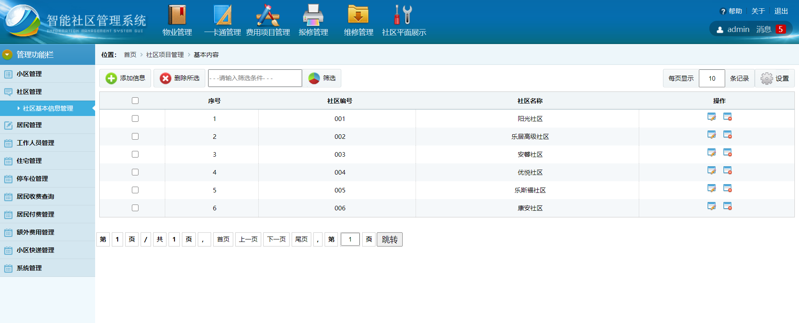

## 基于java智能社区管理系统(程序+课程报告)

###  获取sql数据库文件: 从戎源码网 (https://armycodes.com/) QQ: 386869957 QQ群: 377586148
###  所有系统地址: (https://github.com/YuLin-Coder/AllProjectCatalog) 
###  所有项目以及源代码本人均调试运行无问题 可支持远程安装部署调试、定制修改、代码讲解

## 项目介绍
基于java智能社区管理系统

收费管理 ：智能卡信息添加，只有系统管理员能添加智能卡信息。

 费用维护（修改、删除）系统管理员有此权限。

            费用添加，系统管理员有此权限。

固定类费用缴纳（根据条件查询，显示某住户的基本信息），系统管理员对

住户固定类费用的收取。

非固定类费用缴纳（根据条件查询，显示某住户的基本信息），系统管理员

对住户非固定类费用的收取。

个人缴费查询（所有用户都可以查询某住户某时间内各个费用的缴纳情况）

付费管理： 固定类费（用显示各固定类费用需付费情况）

非固定类费用缴费（显示各非固定类费用需付费情况）

维修管理：  维修信息维护（修改、删除、批量导入、批量导出设备维修信

息）系统管理员有此权限。

          维修信息添加（添加设备维修信息）系统管理员有此权限。  

维修信息查询（所有用户都可以查询设备维修信息）        

业主报修： 维修信息维护（修改、删除、批量导入、批量导出设备维修信

息）系统管理员有此权限。

            维修信息添加（添加设备维修信息）系统管理员有此权限。  

维修信息查询（所有用户都可以查询设备维修信息）    

统计报表：收费统计（系统管理员对某年某月度用户缴费情况的统计分析）

          设备维修统计（系统管理员对某年某月度设备维修情况的统计分

系统管理：包括用户登录、密码重置、用户管理。

用户登录（不同角色的用户进入系统，系统显示相应的页面）。注册的用户

先进行用户注册；忘记密码的用户则可以通过密码提示问题修改原始密码。

密码重置（只有系统管理员有重置用户密码的权限）。

用户维护（修改、删除）系统管理员有此权限。

用户添加，只有系统管理员有权限添加用户信息，并分配其角色。

来访管理：来访者信息维护（修改、删除、批量导入、批量导出来访者信  

息）系统管理员有这些权限。

          来访者信息添加，只有系统管理员能添加来访者信息。

社区信息栏：通知栏（品牌活动，活动反馈，新闻栏）

            意见栏（小区管理意见，交流平台，投诉）

## 项目技术
- 编程语言：Java
- 数据库：MySQL
- 前端技术：JSP、JavaScript、JQuery
- 后端技术：Spring、Struts、Hibernate

## 运行环境
- JDK版本：JDK1.8及以上
- 开发工具：IDEA、Ecplise、Myecplise都可以
- 数据库: MySQL5.7及以上

## 运行截图

